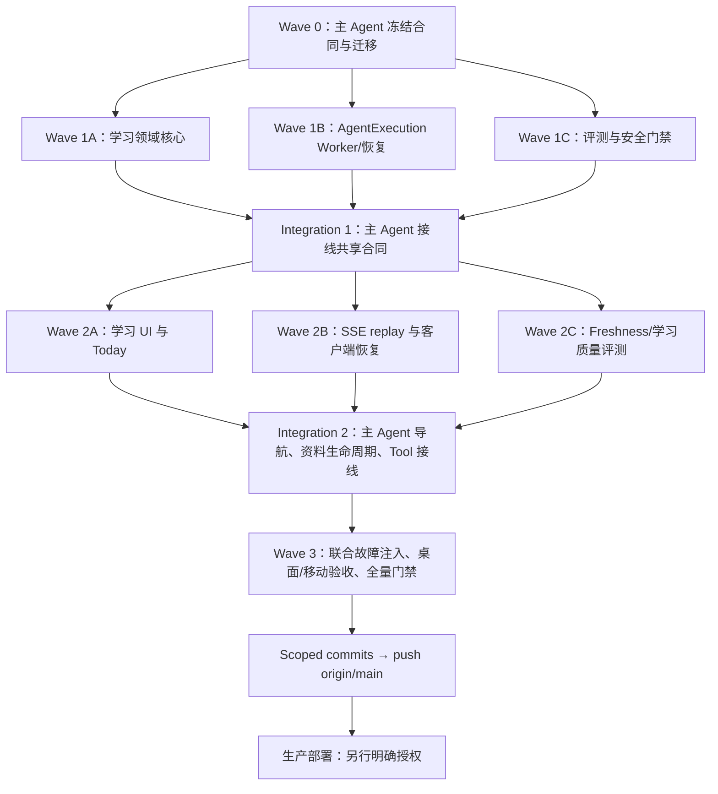

# LumenLab 学习闭环 P0 迭代计划

> 状态：已确认，可作为后续实现任务的执行合同
> 计划基线：2026-07-31
> DeepTutor 调研基线：`HKUDS/DeepTutor@731410e45dd455c34707ad28e001e2b3545c2945`
> LumenLab 调研基线：`light-ai-chat@524a910`；计划收口时本地 `HEAD` 为安全清理提交 `d73172b`，`origin/main` 仍为 `6e0b766`
> 本文性质：迭代计划，不代表本文所列功能已经实现
> 上游分析：工作区本地 `DeepTutor项目复用与迭代分析报告.md`，不随公开仓库提交；本文保持自包含

## 1. 计划结论

P0 的唯一产品目标是形成一条可持续、可追溯的学习闭环：

> 现有 Project 选择或上传资料 → 确认学习范围 → 生成知识点地图 → 完成诊断 → 保存作答与判定 → 进入错题和复习队列 → 在“今天”继续 → 通过后续证据更新掌握状态

这条链路与 AgentExecution 可靠性并行建设。学习功能可以先在 `preview` 状态内测，但只有以下两组能力同时通过发布门禁，P0 才能宣告完成并成为默认入口：

- 学习闭环：目标、范围、知识点、题目、作答、错题、复习、进度和来源状态全部可跨会话延续；
- 可靠执行：Worker/lease、持久事件序号、SSE 续传、审批后自动续跑、幂等重试和进程重启恢复全部成立。

P0 不追求复制 DeepTutor 的功能数量。底层继续复用 LumenLab 的 TypeScript/Prisma、Project、资料解析、RAG、AgentRuntime、Tool Policy、Artifact 和导出能力；前台只回答四个问题：

1. 今天学什么；
2. 为什么先学这个；
3. 我哪里不会；
4. 下一步是什么。

## 2. P0 完成定义

P0 只有在下面所有条件同时成立时完成：

1. 任意现有 Project 都能由用户主动创建 Learning Goal；`review` 类型只做默认推荐，不自动改变 Project 类型。
2. 一个 Project 可保留多个历史 Learning Goal，但数据库和事务共同保证最多一个 `active` Goal。
3. 用户提供的学习范围优先；没有范围时，系统从全部可读 Project Material 生成 Draft Learning Scope，用户确认或缩窄后才能开始正式诊断。
4. 未选择文件表示以全部可读 Project Material 为候选语料，不表示缺少资料；资料缺口必须显式展示，不使用外部知识静默补齐。
5. Knowledge Map 和 Knowledge Point Version 持久化、可版本化，并用稳定 lineage 关联跨版本未变化的知识点。
6. 诊断题在作答前不向浏览器、SSE、HTML、日志或公开 DTO 暴露 Answer Criteria。
7. 客观题、标准数值题和结构化短答可产生正式证据；长论述、证明和开放设计题在 P0 只能提供反馈，不能改变掌握状态。
8. Practice Attempt 追加写入且不可变；同题重做创建新 Attempt，重判创建 linked Attempt Evaluation。
9. 同一题重做属于错题训练并可提升掌握；系统记录 assistance 和实际间隔，不强制生成变式题。
10. 错题集是从 Attempt/Evaluation/Progress 派生的视图，错误解决后仍保留历史。
11. Mastery State 与 Review State 独立；已掌握知识点仍可到期复习。
12. “今天”和项目学习页提供简洁进度环或分段条，展示 `new / learning / mastered` 的近似分布并单列 `due`，不宣称精确掌握率或预测分数。
13. 资料变化只影响关联的知识点和题目；历史证据保留，`needs_revalidation` 不计入当前 mastered，`unsupported` 不再生成正式证据。
14. AgentExecution 能在 HTTP/SSE 断开、审批暂停和进程重启后继续，且不重复文本、消息或工具副作用。
15. `LEARNING_LOOP_ROLLOUT=off` 时，普通聊天、Project、资料、Artifact、导出、Auth 和现有 API 合同无回归。
16. 全量测试、lint、TypeScript、构建、迁移演练、安全检查、桌面端与移动端核心流程全部通过。

## 3. 明确不做

以下内容不进入 P0：

- 新建 Course、Lesson、Enrollment、Teacher、Classroom 等教学平台模型；
- 自动为历史 Project 创建 Learning Goal；
- 强制要求同题重做必须换成变式题；
- 用一个模型分数直接写入 `mastered`；
- 用聊天消息或 Artifact 充当学习状态事实源；
- 完整 Living Book、Marketplace、MCP 管理中心、My Agents 或多 Agent 搭建器；
- 通用 Python/终端代码执行；
- BKT、IRT、复杂遗忘曲线或未经本项目数据校准的概率掌握模型；
- 教师端、同伴协作、班级画像和 Project 分享权限扩展；
- 新的 Python Tutor 微服务或第二套任务运行时；
- 自动生产部署。

## 4. 已冻结的产品与领域合同

词汇以 [CONTEXT.md](../CONTEXT.md) 为准；不可逆或高成本决策以 [ADR 目录](adr/) 为准。

| 决策 | P0 合同 | 执行约束 |
|---|---|---|
| 聚合边界 | Project 继续负责所有权、资料、会话、成果和可选 Learning Goal | 不创建并行 Course 容器；沿用 Project 归属校验 |
| Goal 数量 | 每 Project 多历史 Goal、最多一个 active | 使用数据库部分唯一索引或等价强约束，并用事务切换 |
| 范围 | Scope 必须确认后才可诊断 | 服务端拒绝基于 draft scope 的 map/diagnostic 请求 |
| 资料候选 | 未选文件等于全部可读项目语料 | 不沿用“小文件上限”静默裁剪，不把空选择解释为无资料 |
| 版本 | Map 与 Knowledge Point Version 不覆盖旧版本 | 新版本写新行；稳定 lineage 只连接逻辑上未变化的知识点 |
| Attempt | 作答不可变、追加写入 | 重做新建 Attempt；客户端不能提交 score/mastery |
| Evaluation | 判定可修订但不覆盖 | 新 Evaluation 通过 `supersedesEvaluationId` 指向旧判定 |
| 题型 | 客观/数值/结构化短答可产生证据 | 长论述、证明、开放设计统一为 `feedback_only` |
| 同题重做 | 同题可提升并最终掌握 | 记录帮助程度和实际间隔；variant 不是硬前置 |
| 掌握与复习 | 两套独立状态 | mastered 仍可 due；Review State 由 `nextReviewAt + server clock` 派生 |
| 错题集 | 派生视图 | 不复制题目；resolved 后保留历史 |
| 资料变化 | 只重验证受影响知识点 | 不全量清零；旧证据保留但与当前内容版本区分 |
| 进度 | 简洁、近似、可解释 | 展示状态数量/分布，不显示模型置信分冒充掌握百分比 |
| 发布 | Learning + Reliability 联合门禁 | preview 不等于 P0 完成，默认入口必须等待可靠执行闭环 |

相关 ADR：

- [ADR 0001：Project 继续作为学习上下文边界](adr/0001-project-remains-learning-context-boundary.md)
- [ADR 0002：知识图谱版本化并保留证据](adr/0002-version-knowledge-maps-and-preserve-evidence.md)
- [ADR 0003：Practice Attempt 是追加式证据](adr/0003-practice-attempts-are-append-only-evidence.md)
- [ADR 0004：答案已暴露的同题重做仍可贡献证据](adr/0004-weight-answer-exposed-redos-without-requiring-variants.md)
- [ADR 0005：Mastery State 与 Review State 分离](adr/0005-separate-mastery-state-from-review-state.md)
- [ADR 0006：只重验证受资料变化影响的知识](adr/0006-revalidate-only-knowledge-affected-by-material-changes.md)

## 5. 当前代码基线与真实缺口

### 5.1 可直接复用的底座

| 能力 | 当前落点 | P0 复用方式 |
|---|---|---|
| Project 所有权 | `prisma/schema.prisma`、`src/app/api/projects/**` | Learning 路由先以 session user + Project 做归属校验 |
| 资料解析 | `src/lib/files/parse-job.ts` | 在成功解析/重解析后计算内容指纹并触发局部 freshness 更新 |
| 资料删除 | `src/lib/files/delete-file-asset.ts` | 删除前解析受影响 Source Anchor，删除后标记 unsupported 或 revalidation |
| 全资料预取 | `src/lib/rag/project-material-prefetch.ts` | Draft Scope 和 Map 生成沿用“空选择=全可读语料”语义 |
| Project 索引/RAG | `src/lib/rag/project-index.ts`、`src/lib/rag/vector-store.ts` | 为知识点与题目提供候选内容，不直接决定掌握 |
| AgentRuntime | `src/lib/agent/runtime.ts` | 保留统一 Provider/Tool loop，不新建学习专用 Runtime |
| Tool Policy | `src/lib/agent/tools/tool-runner.ts`、`src/lib/agent/policy-engine.ts` | Learning Tool 继续走所有权、风险和审计 |
| Artifact/导出 | `src/app/api/projects/[id]/artifacts/route.ts`、`src/lib/export/**` | P1 Study Pack 复用；P0 错题事实不落 Artifact |
| 当前工作台 | `src/app/(chat)/projects/[id]/page.tsx`、`src/components/layout/sidebar.tsx` | 主 Agent 在独立组件完成后做单点接线 |

### 5.2 学习域缺口

当前 Prisma 没有以下事实：

- Learning Goal 与确认后的 Learning Scope；
- 版本化 Knowledge Map、Knowledge Point lineage 和 Source Anchor；
- Practice Item 与服务端 Answer Criteria；
- Practice Attempt、Attempt Evaluation 和证据政策版本；
- Mastery/Review 投影；
- Wrong-Answer Collection 查询；
- Today 任务和学习会话。

现有“错题解析”快捷任务或 Artifact 只是生成内容，不是错题集事实源，不能复用为持久化错题状态。

### 5.3 AgentExecution 缺口

已有：

- `AgentExecution` / `AgentExecutionEvent` Prisma 模型；
- provider-neutral checkpoint v1；
- `PrismaAgentExecutionStore` 的 create、claim、lease、expired recovery、approval wait/resume 和幂等事件写入；
- ToolExecution、ApprovalToken、approve/reject 安全校验；
- 当前请求内 SSE 和前端 Agent timeline。

尚未具备：

- 生产代码中的 Agent Worker；
- Chat 请求创建/绑定 AgentExecution；
- Runtime checkpoint 恢复执行；
- execution status/events API；
- `Last-Event-ID`/sequence replay；
- 审批完成后 Provider 自动 continuation；
- durable cancel、terminal transition、retry/backoff；
- tool call 的稳定幂等键；
- 真实 PostgreSQL 双 Worker 和崩溃恢复测试。

现有相关基础测试审计结果为 9 个文件、59 个测试通过；这只证明 store、approve/reject、loop、ToolRunner 等现有基础行为，不证明可恢复执行闭环。

### 5.4 Kimi Code 最近会话与文档安全工作流

计划收口时已通过 `kimi -r` 检查最近两个 Kimi Code 会话：

- `session_c166a448-7de3-4c75-bf1b-55ae7575604a`：公开 `/docs`、GitHub 仓库和文档的敏感信息审计，并执行高/中风险清理；
- `session_9270f966-e7c9-4520-9917-63cbc5dec934`：聊天/侧边栏 UI 改进和生产发布，最终提交为当前 `origin/main` 的 `6e0b766`；该会话不是文档安全改动。

第一个会话形成的安全清理已由独立的持续 `kimi --yolo` 会话完成为本地提交 `d73172b6050ae5028c0057d8143c5248b368785d`（`security: sanitize public docs and internal ops metadata`），主要包括：

- 公共配置和文档中的基础设施标识改为占位符；
- `docs/LumenLabDocs/deployment.md` 改成通用自托管指南，不再包含生产路径、SSH 别名和具体运维拓扑；
- `scripts/seed-dev-access.ts` 取消硬编码默认密码，要求显式 `DEV_USER_PASSWORD`；
- `.gitignore` 排除内部 QA、内部接口文档和内部部署文件；
- 相关测试改用占位域名。

该提交还通过 path-scoped `git rm --cached` 将 `docs/qa/**`、`接口文档.md`、`scripts/deploy.sh` 和 `deploy/**` 移出 Git index，本地文件均保留；3 个定向测试文件共 15 个测试通过，限定范围的 `git diff --check` 通过，暂存区为空。`CONTEXT.md`、本计划、`docs/adr/**` 和无关的 Logo 删除均未进入该提交。

该工作流必须作为独立安全变更保留，不得被本计划覆盖或归入学习功能提交。计划收口时该提交仅存在于本地 `main`，比 `origin/main` 领先 1 个提交；未执行 push 或部署。因此公开远端的 Git 层面清理仍要以未来明确的推送动作为生效边界，不能把“本地已提交”误写成“远端已完成”。

本计划本身和后续新增公开文档必须遵守同一边界：

- 不记录真实域名、IP、SSH 入口、服务器路径、面板类型、凭据或恢复码；
- 不把内部运维手册、QA 截图、真实账号资料发布到 `/docs`；
- `.env.example` 只使用占位值；
- 不读取、复制或复述工作区本地凭据文件；
- 公共架构说明可以描述合同和安全原则，不公开生产可操作细节。

## 6. 目标数据合同

### 6.1 Prisma 实体

下表是 P0 的目标职责，不要求字段名逐字照搬；任何改名必须保持职责分离。

| 实体 | 核心字段/关系 | 不变量 |
|---|---|---|
| `LearningGoal` | `userId`、`projectId`、title、purpose、targetDate、dailyMinutes、status | 每 Project 最多一个 active；历史 Goal 不删除证据 |
| `LearningScope` | goal、version、status、definition、materialMode、fileIds、materialGaps、confirmedAt | draft 不能驱动正式诊断；`project_corpus` 覆盖全部可读资料 |
| `KnowledgeMap` | goal、scope、version、generation metadata、source fingerprint | 新生成只追加版本；旧版本仍可解释历史 |
| `KnowledgePointLineage` | goal、stableKey | 跨 Map 保持逻辑身份；不得跨 Goal 复用 |
| `KnowledgePoint` | map、lineage、name、kind、order、freshness | 表示一个 immutable version；历史 Attempt 指向具体版本 |
| `SourceAnchor` | fileAsset、optional chunk、locator、contentFingerprint、excerptHash | 必须能回链项目资料；不存外部伪来源 |
| `KnowledgePointSourceAnchor` | knowledgePoint、sourceAnchor | 多对多显式关联 |
| `PracticeItemLineage` | goal、stableKey、optional predecessor metadata | 跨版本保持同一逻辑题身份；不得跨 Goal 复用 |
| `PracticeItem` | goal、map、lineage、version、prompt、type、mode、answerCriteria、explanation、generation metadata、freshness | Answer Criteria 只在服务端 DTO；题目修订新建版本 |
| `PracticeItemKnowledgePoint` | item、knowledgePoint | 一题可关联多个知识点，权重为服务端策略 |
| `PracticeItemSourceAnchor` | item、sourceAnchor | evidence-bearing 题目至少一个有效锚点 |
| `LearningSession` | goal、map、mode、status、agentExecutionId、startedAt、completedAt | 诊断/复习范围可恢复；不依赖历史聊天定位 |
| `LearningSessionItem` | session、practiceItem、order、status | 固定一次 session 的题序和完成状态 |
| `PracticeInteractionEvent` | sessionItem、type、createdAt | 服务端记录 `hint_revealed`、`answer_revealed`；不可由 Attempt 请求伪造 |
| `PracticeAttempt` | user、sessionItem、item version、answer、assistanceLevel、spacingSeconds、idempotencyKey、submittedAt | append-only；score、verdict、mastery 不在此表 |
| `AttemptEvaluation` | attempt、verdict、score、rubric、confidence、errorType、reason、model/policy version、supersedesEvaluationId | 重判新增记录；旧 Evaluation 不覆盖 |
| `KnowledgePointProgress` | user、goal、lineage、masteryState、nextReviewAt、policyVersion、evidenceAsOf | 可重建的投影；模型不能直接写；Review State 由时间派生；freshness 由当前对象与 Source Anchor 派生 |

### 6.2 枚举

| 枚举 | 值 |
|---|---|
| `LearningGoalStatus` | `active`、`paused`、`completed`、`replaced` |
| `LearningScopeStatus` | `draft`、`confirmed` |
| `PracticeMode` | `evidence_bearing`、`feedback_only` |
| `AssistanceLevel` | `independent`、`hinted`、`answer_exposed` |
| `EvaluationVerdict` | `correct`、`partial`、`incorrect`、`uncertain` |
| `MasteryState` | `new`、`learning`、`mastered` |
| `ContentFreshness` | `current`、`needs_revalidation`、`unsupported` |
| `LearningSessionMode` | `diagnostic`、`review` |
| `LearningSessionStatus` | `draft`、`ready`、`in_progress`、`completed`、`cancelled` |

`ReviewState` 不单独写一个会随时钟漂移的字段：

- `nextReviewAt = null` → `unscheduled`；
- `nextReviewAt > serverNow` → `scheduled`；
- `nextReviewAt <= serverNow` → `due`。

### 6.3 数据库强约束

主 Agent 在迁移中负责以下强约束：

1. `LearningGoal` 使用 PostgreSQL 部分唯一索引保证每个 `projectId` 最多一个 `active`。
2. `LearningScope`、`KnowledgeMap`、Practice Item version 使用组合唯一键。
3. `PracticeAttempt` 使用 `(userId, idempotencyKey)` 唯一键，重复提交返回第一次结果。
4. `KnowledgePointLineage` 使用 `(goalId, stableKey)` 唯一键，`KnowledgePoint` 使用 `(knowledgeMapId, lineageId)` 唯一键。
5. `PracticeItemLineage` 使用 `(goalId, stableKey)` 唯一键，`PracticeItem` 使用 `(lineageId, version)` 唯一键。
6. `ToolExecution` 与 `AgentExecution` 建立明确关联，并为 `(agentExecutionId, providerToolCallId)` 或等价键建立唯一约束。
7. 所有关系按 Project/账户删除语义设置 Cascade 或显式清理；Source Anchor 不能绕过 Project 所有权。
8. 所有模型生成 JSON 在入库前通过 Zod；数据库 Json 字段不是“任意模型输出”通道。
9. 新迁移只新增表、字段和索引，不为旧 Project 回填 Learning Goal。

Lineage 匹配不是模型可随意覆盖的模糊合并：

- Knowledge Point 仅在概念边界和来源语义未变时复用稳定 key；纯改名可以复用；
- Knowledge Point split/merge 或概念边界变化必须创建新 lineage，可记录 predecessor 关系但不搬运 mastery；
- Practice Item 仅在考查目标和 Answer Criteria 语义未发生实质变化时复用 lineage；改写措辞或刷新等价 Source Anchor 可以新建同 lineage version；
- 题目目标、正确答案、容差或 Rubric 的实质变化必须创建新 lineage；
- 无法确定时创建新 lineage 并进入人工/评测复核，不允许靠相似度自动合并历史证据。

`ContentFreshness` 的事实源是当前 version-specific `KnowledgePoint` / `PracticeItem` 与其 Source Anchor fingerprint。`KnowledgePointProgress` 不保存第二份可独立修改的 freshness；进度查询通过当前 Map 对象派生 `current / needs_revalidation / unsupported`，避免双写漂移。

### 6.4 FileAsset 内容版本

P0 为 `FileAsset` 增加可空的 `contentFingerprint` 或等价版本标识：

- 成功解析/增强后的有效正文通过确定性算法生成；
- 新文件在解析完成时写入；
- 旧文件在首次建立 Scope/Map 时懒计算，不批量重写；
- Source Anchor 保存生成时使用的 fingerprint；
- 重解析后 fingerprint 不变则不触发学习状态变化；
- fingerprint 变化只标记关联点；
- 文件删除且无替代锚点时标记 `unsupported`。

## 7. 服务与 API 合同

### 7.1 服务层

新增目录：

```text
src/lib/learning/
├── contracts.ts
├── validators.ts
├── feature-flags.ts
├── goal-service.ts
├── scope-service.ts
├── knowledge-map-service.ts
├── source-anchor-service.ts
├── practice-service.ts
├── grading/
├── evidence-policy.ts
├── progress-projector.ts
├── review-scheduler.ts
├── wrong-answer-query.ts
├── today-service.ts
└── freshness-service.ts
```

约束：

- `evidence-policy.ts`、`review-scheduler.ts` 和确定性判分尽量保持纯函数；
- service 负责所有权、事务和状态迁移；
- Provider Adapter 和 Skill 不直接写 Prisma 学习表；
- model output 必须先通过 contracts/validators；
- API、Tool 和后台任务调用同一 service，不复制规则；
- 时间、随机数、模型调用和 ID 生成可注入，便于确定性测试。

### 7.2 路由

建议使用 Project 归属范围内的路由：

| 路由 | 方法 | 职责 |
|---|---|---|
| `/api/projects/[id]/learning/goals` | `GET/POST` | 列出历史 Goal、创建并可事务激活 |
| `/api/projects/[id]/learning/goals/[goalId]` | `GET/PATCH` | 读取、暂停、完成、替换 |
| `/api/projects/[id]/learning/goals/[goalId]/scope` | `GET/PUT` | 生成 draft、由用户确认/缩窄 |
| `/api/projects/[id]/learning/goals/[goalId]/map` | `GET/POST` | 读取 current map、生成新版本 |
| `/api/projects/[id]/learning/goals/[goalId]/diagnostics` | `POST` | 为 confirmed scope 创建 5–10 题诊断 session |
| `/api/projects/[id]/learning/sessions/[sessionId]` | `GET` | 返回不含 Answer Criteria 的 session |
| `/api/projects/[id]/learning/sessions/[sessionId]/items/[sessionItemId]/hint` | `POST` | 服务端记录该 session item 的 hint 事件并返回受控提示 |
| `/api/projects/[id]/learning/sessions/[sessionId]/items/[sessionItemId]/answer` | `POST` | 服务端记录该 session item 的 answer exposure；诊断中默认需先提交 |
| `/api/projects/[id]/learning/sessions/[sessionId]/items/[sessionItemId]/attempts` | `POST` | 幂等保存绑定该 session item 的 Attempt、生成 Evaluation、更新投影 |
| `/api/projects/[id]/learning/goals/[goalId]/reviews` | `GET/POST` | 列出到期项、创建 review session |
| `/api/projects/[id]/learning/goals/[goalId]/wrong-answers` | `GET` | 返回 unresolved/resolved 派生视图 |
| `/api/projects/[id]/learning/goals/[goalId]/progress` | `GET` | 返回可视化所需状态数量与 due 数 |
| `/api/learning/today` | `GET` | 聚合用户所有 active Goal 的今日任务 |

所有路由必须：

- 先从 session 得到 userId，再验证 Project/Goal/Session/Item 归属；
- 校验 path 中 `sessionId` 与 `sessionItemId` 的父子关系；同一 Practice Item 出现在多个 session 时不得猜测归属；
- 忽略或拒绝客户端传入的 userId、score、verdict、mastery、assistanceLevel、spacing；
- 使用一致错误码区分 `scope_not_confirmed`、`source_unsupported`、`answer_not_available`、`evaluation_uncertain`；
- 在 feature flag `off` 时 fail closed；
- 对创建、提交、重试操作支持稳定 idempotency key。

### 7.3 受控 Learning Tool

P0 可以为 AgentRuntime 增加以下内部 Tool：

- `learning.goal.upsert`
- `learning.map.generate`
- `learning.practice.create`
- `learning.attempt.submit`
- `learning.review.next`
- `learning.progress.read`

Tool 只调用 learning service：

- 不信任模型提供的 userId；
- projectId 必须来自已验证的 resource context；
- 读操作按现有 L1 规则；
- 写操作按当前 Policy 注册适当风险；
- 删除、外发和批量覆盖不因“学习功能”降低审批；
- Tool 不能直接传入 Answer Criteria 给前端；
- 不新增顶级 Runtime，不要求用户理解 Tool/Skill。

`src/lib/agent/tool-registry.ts`、公共类型和 Skill allowlist 由主 Agent 单点接线。现有 `exam-coach` / `socratic-tutor` 可以调用新能力，但直达 UI 的学习闭环不能依赖 Skill 自动激活成功。

## 8. 判分、证据与复习政策 v1

### 8.1 题型门槛

| 题型 | P0 模式 | 判定方式 |
|---|---|---|
| 单选、判断 | evidence-bearing | 确定性答案比较 |
| 多选 | evidence-bearing | 集合比较，顺序无关 |
| 标准数值题 | evidence-bearing | 单位归一、容差与有效数字规则 |
| 结构化短答 | evidence-bearing | 版本化 Rubric、关键概念覆盖、置信度 |
| 长论述、证明、开放设计 | feedback-only | 可给建议，不更新 Mastery |
| 无可靠来源或 Answer Criteria | 不得进入正式诊断 | 返回资料缺口或改为 feedback-only |

低置信度短答判定使用 `uncertain`：

- 可进入错题视图等待复核；
- 不把用户大幅降级或升级；
- 保存 Rubric、理由、置信度和模型版本；
- 后续重判写新 Evaluation。

### 8.2 Assistance 与实际间隔

Assistance Level 由服务端事件推导：

- session 中没有 hint/answer exposure → `independent`；
- 提交前发生 hint event → `hinted`；
- 提交前发生 answer exposure → `answer_exposed`。

`spacingSeconds` 由服务端使用当前提交时间减去同一 `PracticeItemLineage` 的上一次 Attempt 时间计算。客户端提交的布尔值或时长不作为事实。题目版本更新但仍满足同 lineage 规则时继续累计 spacing；新 lineage 不继承该间隔。

证据强度必须满足以下单调顺序：

> spaced independent > spaced same-item redo > hinted > immediate answer-exposed

精确权重、阈值和间隔配置存放在版本化 policy 中，不写成永久产品真理。不可破坏的规则是：

1. 每一级证据都可以改善 learning state；
2. 单次立即 answer-exposed 重做不能独立把知识点设为 mastered；
3. mastered 需要 stronger、multiple 或 spaced evidence；
4. 多次有间隔的同题成功可以达到 mastered，variant 不是必要条件；
5. 新的相反证据可以把投影从 mastered 调整为 learning，但不删除旧证据；
6. `needs_revalidation` 的历史正确证据不计入 current mastered，直到当前资料版本证据恢复。

### 8.3 错误类型

P0 使用少量、可解释的分类：

- `knowledge_gap`：不知道或记忆缺失；
- `misconception`：概念误解；
- `method_choice`：方法选择错误；
- `calculation_or_operation`：计算或操作失误；
- `reading_or_time`：审题或时间问题；
- `uncertain_evaluation`：判分不确定。

用户可修正错误类型；修正是独立人工证据，不覆盖原模型 Evaluation。

### 8.4 Wrong-Answer Collection

错题集不建第二份题库。查询视图包含：

- incorrect、partial 或 uncertain 的有效 Evaluation；
- 尚未满足 resolution policy 的历史错题；
- 题目、用户答案、当前解释、Source Anchor；
- Knowledge Point、错误类型、assistance、实际间隔；
- 每次重做和判定历史；
- 当前 mastery、review 和 freshness；
- `resolved` 状态与解决所依据的 evidence。

resolved 错题仍可筛选和回看；删除 Project/Goal 才随所有权生命周期清理。

### 8.5 Review 策略

P0 使用确定、可测试、版本化的简单策略：

- incorrect/partial、hinted、answer-exposed 或 uncertain 缩短下一次间隔；
- spaced independent success 逐步延长；
- mastered 可继续 scheduled/due；
- unsupported 不生成新 review item；
- needs_revalidation 优先安排当前版本验证；
- 策略变更只影响新投影计算，历史记录保留 policy version。

## 9. 内容版本与局部重验证

资料生命周期接线点：

- 上传和解析入队：`src/app/api/projects/[id]/files/route.ts`
- 解析成功/重解析：`src/lib/files/parse-job.ts`
- 单文件重解析：`src/app/api/files/[id]/parse/route.ts`
- 批量重解析/删除：`src/app/api/projects/[id]/files/batch/route.ts`
- 通用删除：`src/lib/files/delete-file-asset.ts`

主 Agent 在这些共享路径中调用 `freshness-service`，子 Agent 不直接并发修改。

状态迁移：

1. fingerprint 未变化：学习对象维持 `current`；
2. fingerprint 变化且仍有来源：关联 Knowledge Point/Practice Item → `needs_revalidation`；
3. 来源删除且存在替代 Anchor：仍为 `needs_revalidation`，等待重建；
4. 来源删除且无替代 Anchor：→ `unsupported`；
5. 新 Map 生成：旧 Map 保留，新 Knowledge Point Version 通过 lineage 连接；
6. 未变化 Anchor 的 lineage 可继续使用原有效 evidence；
7. 变化 Anchor 的 lineage 保留历史，但当前投影不计 mastered；
8. 当前版本的新 evidence 通过政策后恢复 `current`。

禁止：

- 因一份文件变化重置整个 Goal；
- 删除旧 Attempt/Evaluation；
- 让 stale/unsupported Practice Item 继续产生 current evidence；
- 把“检索没找到”当成“资料不存在”；
- Map 生成失败时覆盖当前可用版本。

## 10. “今天”与学习 UI

### 10.1 路由与组件

新增：

```text
src/app/(chat)/today/page.tsx
src/app/(chat)/projects/[id]/learning/page.tsx
src/components/learning/
src/lib/hooks/use-learning-*.ts
```

主 Agent 最后修改共享热点：

- `src/app/page.tsx`
- `src/app/(chat)/layout.tsx`
- `src/components/layout/sidebar.tsx`
- `src/components/layout/mobile-floating-nav.tsx`
- `src/app/(chat)/projects/[id]/page.tsx`
- `src/components/project/project-sidebar.tsx`
- `src/lib/api/types.ts`
- `src/lib/query-keys.ts`

### 10.2 新用户流程

1. “开始学习”；
2. 选择现有 Project 或创建/上传资料；
3. 填写目标/用途，可选目标日期和每天投入；
4. 如果没有明确范围，展示系统生成的 Draft Scope；
5. 用户一键确认或缩窄；
6. 生成 Knowledge Map；
7. 开始 5–10 题诊断；
8. 每题先作答，再显示判定、解释和来源；
9. 完成后展示错题、薄弱点、due 计划和唯一下一步。

### 10.3 老用户“今天”

Today 按以下优先级选择一个明确下一步：

1. overdue/due 且 current 的 review；
2. needs_revalidation 的知识点；
3. 未完成 diagnostic session；
4. active Goal 中 learning 状态的高价值知识点；
5. 没有 Goal 时引导从现有 Project 开始。

用户有多个 Project 的 active Goal 时，Today 聚合并显示来源 Project，不静默创建一个全局 active Goal。

### 10.4 进度可视化

使用一个简洁的分段条或进度环：

- 分段：`new`、`learning`、`mastered(current)`；
- `due` 作为独立数字/徽标；
- `needs_revalidation` 与 `unsupported` 使用单独的中性状态；
- mastered(current) 明确排除 needs_revalidation；
- 辅助文本显示各状态数量；
- 不显示“掌握率 87%”“预计得分”等精确结论；
- 提供 `aria-label`/文本等价信息；
- 桌面端和移动端均无需 hover 才能理解；
- 遵守当前无可见卡片描边、无深灰 hover 的 UI 设计语言。

### 10.5 兼容

- 普通聊天入口继续存在；
- Project、资料、转换、成果功能继续存在；
- 不要求用户选择模型或 Skill 才能完成学习；
- `review` Project 显示更明显的学习建议，其他类型同样可 opt in；
- 没有 Goal 的历史 Project API 响应保持兼容；
- feature flag `off` 时不增加默认导航噪音。

## 11. AgentExecution 可靠性实施合同

### 11.1 ID 与事件合同冻结

三个 ID 不得混用：

- `agentExecutionId`：一次完整 Agent Run；
- `toolExecutionId`：一次 Tool 提议、审批和执行；
- `providerToolCallId`：Provider 返回的原始工具调用标识。

为兼容现有前端，现有 `AgentEvent.executionId` 在旧事件中继续表示 ToolExecution；durable envelope 显式增加 run-level 字段：

```ts
type DurableAgentEvent = {
  schemaVersion: 1;
  agentExecutionId: string;
  sequence: number;
  type: string;
  payload: unknown;
};
```

Chat 在首条事件前交付 run identity：

- 客户端为每次发送生成稳定 `clientRunKey`，重试同一发送必须复用；
- `/api/chat` 以 `(userId, clientRunKey)` 幂等创建或取回同一个 AgentExecution；
- SSE 响应在 body 前通过 `X-Agent-Execution-Id` 返回 `agentExecutionId`，首个 durable event 也重复携带该 ID；
- 若连接在收到响应头前中断，客户端用相同 `clientRunKey` 重试 `/api/chat`，服务端不得创建第二个 run；
- 客户端一旦获得 ID，后续使用 execution events API 和 sequence cursor 恢复。

### 11.2 Store 扩展

`AgentExecutionStore` 至少补充：

- `getOwnedExecution`
- `listEventsAfter(sequence)`
- `saveCheckpoint`
- `markCompleted`
- `markFailed`
- `markCancelled`
- `scheduleRetry`
- `expireWaitingApproval`

所有运行态写入必须验证当前 `leaseOwner` 和未过期 lease。旧 Worker 丢失 lease 后不能继续写 checkpoint、event 或 terminal state。

### 11.3 Worker

新增建议路径：

```text
src/lib/agent/executions/agent-execution-worker.ts
src/lib/agent/executions/agent-execution-runner.ts
src/lib/agent/executions/event-codec.ts
src/lib/agent/executions/retry-policy.ts
```

要求：

- Worker 从 store 条件 claim queued run；
- 心跳续租；
- 启动时 recover expired run 并 drain pending；
- 开发热重载不会启动多个无限 loop；
- 支持优雅停止；
- 最大 attempt 和退避有界；
- poison run 进入明确 failed，不无限热循环；
- HTTP/SSE 订阅断开不取消 Worker；
- 用户显式 cancel 才传播 AbortSignal，并在工具边界再次检查。

### 11.4 Checkpoint 边界

以下边界前后保存 provider-neutral checkpoint：

1. Provider round 前；
2. Provider round 结果解析后；
3. Tool dispatch 前；
4. Tool terminal result 后；
5. Provider continuation 前；
6. assistant message 最终持久化前后。

Checkpoint 需包含恢复所需的 messages、round、model、skill、RAG/file scope、pending call 和已完成 Tool result；继续拒绝凭据、Authorization、cookie、provider-private continuation handle，并限制大小和数组长度。

### 11.5 审批自动续跑

Runtime 遇到审批时，必须形成一致状态：

- ToolExecution 为 `pending_approval`；
- AgentExecution 为 `waiting_approval`；
- checkpoint 保存 pending call；
- durable approval event 已写入；
- Worker 释放 lease。

批准、拒绝和 token 过期都必须把结构化 Tool result 接回同一 AgentExecution 并自动重新入队。审批后用户无需补发消息即可得到终答。

`/api/agent/approve` 在迁移期间仍是权威入口。实现需要关闭“token 已消费但 Tool 尚未 claim”的 crash window：优先使用单事务；若受现有 token 合同限制，则提供可安全重入的 claimed 状态和恢复逻辑。

### 11.6 幂等与副作用

- 同一 `(agentExecutionId, providerToolCallId)` 只创建一个 ToolExecution；
- Worker retry 复用已存在 terminal result；
- 内部数据库写通过唯一约束/事务实现逻辑 exactly-once；
- 外部 Tool 必须传稳定 idempotency key；
- 外部目标不支持幂等且结果未知时进入 `unknown/manual_recovery` 或等价终态，禁止盲重试；
- “Tool 成功后、checkpoint 尚未推进”是必须覆盖的故障注入场景。

### 11.7 SSE replay

新增所有权受控路由：

```text
GET /api/agent/executions/[id]
GET /api/agent/executions/[id]/events
POST /api/agent/executions/[id]/cancel
POST /api/agent/executions/[id]/retry
```

事件流要求：

- 每条 SSE 使用数据库 sequence 写 `id: <sequence>`；
- 支持 `Last-Event-ID` 或 `afterSequence`；
- 先 replay `sequence > cursor`，再追随新事件；
- 客户端按 `(agentExecutionId, sequence)` 去重；
- 终态事件后连接正常结束；
- reconnect 不重复文本、timeline 卡片、assistant message 或 Tool；
- 现有 `/api/chat` 请求字段和 `event: agent` 兼容层继续可用。

### 11.8 故障注入

至少覆盖：

1. claim 后、Provider 调用前崩溃；
2. Provider 返回后、事件落库前崩溃；
3. Tool 成功后、checkpoint 前崩溃；
4. waiting approval 时应用重启；
5. approve 成功后、重新入队前崩溃；
6. SSE 中途断线再连接；
7. stale Worker 恢复后继续写；
8. poison run 超过最大 attempt。

验收结果必须是：

- 无丢失 Run；
- 无重复业务副作用；
- 无重复 terminal event；
- event sequence 唯一、单调、可补发；
- Run 最终进入 `completed / failed / cancelled / waiting_approval` 中一个可解释状态。

## 12. Feature Flag 与发布状态

### 12.1 学习功能

使用一个服务端权威枚举：

```text
LEARNING_LOOP_ROLLOUT=off|preview|default
```

- `off`：Learning API/route fail closed；`/` 对登录用户仍跳 `/chat`；
- `preview`：显示可选学习入口，允许内部走完整链路，但默认入口仍为 `/chat`；
- `default`：登录用户默认进入 `/today`，主导航优先显示“今天”。

### 12.2 Durable execution

使用独立开关：

```text
AGENT_DURABLE_EXECUTION_ENABLED=false|true
```

不要把 `AGENT_RUNTIME_MODE=new` 等同于 durable 已完成。配置层必须拒绝 `LEARNING_LOOP_ROLLOUT=default` 与 durable execution 关闭的非法组合。

### 12.3 回滚

- UI/产品回滚先把 rollout 调为 `preview` 或 `off`；
- durable 回滚恢复旧 Chat 请求内路径，但保留 AgentExecution 数据用于审计；
- additive migration 不因功能关闭删除学习数据；
- projection 可从 Attempt/Evaluation 重建；
- Map/Practice 版本不原地回退；
- 生产部署和数据库生产迁移必须另行获得用户明确授权。

## 13. 并行执行治理

### 13.1 总规则

1. 主 Agent 先完成 Contract Freeze，之后最多同时派遣 3 个子 Agent。
2. 共享热点只有主 Agent 可修改；子 Agent 在独立目录交付实现、测试或改动清单。
3. 子 Agent 每个任务必须声明 `owns`、`must_not_touch`、`depends_on`、`deliverables`、`acceptance`、`integration_owner`。
4. 主 Agent 在每个 Wave 结束后先审查 diff 和测试，再做共享接线。
5. 不因一个子任务完成就等待用户确认；按 Wave 连续推进。
6. 只有以下情况暂停：
   - 需要改变本文已确认的产品/领域范围；
   - 需要新的高风险生产或破坏性授权；
   - 与用户现有改动出现无法隔离的冲突；
   - 已穷尽安全替代方案，仍需用户输入或外部状态变化。
7. 不以“希望确认”“下一步是否继续”作为常规停点。

### 13.2 主 Agent 单一所有权

下列共享文件不得分给多个子 Agent：

- `prisma/schema.prisma`
- `prisma/migrations/**`
- `src/generated/prisma/**`（只生成，不提交）
- `src/lib/api/types.ts`
- `src/lib/query-keys.ts`
- `src/lib/validators.ts`
- `src/lib/chat-request.ts`
- `src/lib/agent/contracts.ts`
- `src/lib/agent/runtime-events.ts`
- `src/lib/agent/types.ts`
- `src/lib/agent/executions/agent-execution-store.ts`
- `src/lib/agent/runtime.ts`
- `src/lib/agent/loop/agent-loop.ts`
- `src/lib/agent/tools/tool-runner.ts`
- `src/lib/agent/persistence/**`
- `src/lib/agent/approval-token.ts`
- `src/lib/agent/tool-registry.ts`
- `src/app/api/chat/route.ts`
- `src/app/api/chat/request-mapper.ts`
- `src/app/api/chat/response-stream.ts`
- `src/app/api/agent/approve/route.ts`
- `src/app/api/agent/reject/route.ts`
- `src/lib/hooks/use-chat.ts`
- `src/components/chat/chat-area.tsx`
- `src/app/(chat)/layout.tsx`
- `src/app/(chat)/projects/[id]/page.tsx`
- `src/components/project/project-sidebar.tsx`
- `src/components/layout/sidebar.tsx`
- `src/components/layout/mobile-floating-nav.tsx`
- `src/lib/files/parse-job.ts`
- `src/lib/files/delete-file-asset.ts`
- `instrumentation.ts`
- `.env.example`
- `package.json`、`package-lock.json`
- `.github/workflows/ci.yml`
- `REPOSITORY_INDEX.md`、`PROJECT_SUMMARY.md` 和工作区 `log.md`

### 13.3 开工前工作树保护

计划编写时仓库已有多组无关未提交改动。未来执行必须：

- 先重新运行 `git status --short --branch`；
- 先确认 Kimi 文档安全工作流已独立提交，或继续把其全部路径隔离为既有改动；
- 不使用 `git add .`；
- 只按明确 owned path 暂存；
- 不恢复、不暂存、不提交当前无关删除 `public/LumenLab-logo-refined.png`；
- 不把当前 `.env.example`、`.gitignore`、README、部署文档、seed 脚本和相关测试的文档安全清理冒充为本计划修改；确需 feature flag 接线时由主 Agent 逐块合并；
- 如果共享文件已有用户改动，先做逐块合并；只有无法安全隔离时才暂停。

## 14. 执行 Wave



### Wave 0：Contract Freeze，由主 Agent 独占

任务：

- `CF-00`：核对 Kimi 文档安全工作流是否已独立收尾；未收尾时建立明确 path exclusion。
- `CF-01`：重新核对 `origin/main`、工作树、AGENTS、REPOSITORY_INDEX 和当前迁移状态。
- `CF-02`：冻结本计划枚举、DTO、错误码、事件 envelope、三个 execution ID 语义。
- `CF-03`：新增 learning contracts/validators/feature flags 骨架。
- `CF-04`：修改 Prisma schema，创建 additive migration、部分唯一索引、幂等索引和 AgentExecution/ToolExecution 关联。
- `CF-05`：生成 Prisma client，跑空库/现有库迁移演练。
- `CF-06`：冻结 API 路由清单、公共响应中 Answer Criteria 的排除规则。
- `CF-07`：建立 P0 fixtures 和可注入 clock/model/id 约定。
- `CF-08`：验证 Skill Discovery 与 `skill.activate` schema 的一致性，确认 UI 不把“写作指导”描述成已生成二进制文件。

验收：

- migration 可部署且旧 Project/Conversation 不回填 Goal；
- 一 active Goal 强约束有并发测试；
- `off` 模式普通聊天测试通过；
- 子 Agent 可仅依据冻结合同独立工作；
- Contract Freeze 形成一个仅含 owned paths 的绿色本地提交。

### Wave 1A：学习领域核心

`owns`

- `src/lib/learning/**`
- `src/app/api/projects/[id]/learning/**`
- 上述目录对应测试

`must_not_touch`

- Prisma schema/migration/generated client
- 现有 Project CRUD、Chat/Runtime/Agent 公共合同
- Project 总编排、主导航、Project sidebar
- `src/lib/files/parse-job.ts`、`src/lib/files/delete-file-asset.ts`

`depends_on`

- Wave 0 Prisma client、DTO、feature flag、clock/id/model seams

`deliverables`

- Goal/Scope 状态机和 one-active 事务；
- confirmed scope 服务端门禁；
- Map/lineage/version/Source Anchor；
- diagnostic session 和 5–10 题生成；
- 分题型 grading；
- append-only Attempt/Evaluation；
- evidence policy、progress projector、review scheduler；
- wrong-answer/today query；
- freshness service 的纯接口与回调。

`acceptance`

- 领域纯函数和 route tests；
- 越权、答案泄漏、幂等、历史不覆盖测试；
- 所有 JSON 输出通过 Zod；
- 不修改共享文件。

`integration_owner`

- Main Agent

### Wave 1B：AgentExecution Worker 与恢复

`owns`

- 新增 `src/lib/agent/executions/agent-execution-worker.ts`
- 新增 `src/lib/agent/executions/agent-execution-runner.ts`
- 新增 `src/lib/agent/executions/event-codec.ts`
- 新增 `src/lib/agent/executions/retry-policy.ts`
- 对应独立测试

`must_not_touch`

- Prisma、store 公共 interface、Runtime、loop、ToolRunner
- Chat API/SSE、approve/reject、instrumentation
- learning 目录、UI、eval dataset

`depends_on`

- Wave 0 execution event/ID/checkpoint contract

`deliverables`

- claim/heartbeat/recover/drain/stop worker；
- lease-aware runner；
- bounded retry/backoff；
- checkpoint orchestration adapter；
- fault injection hooks；
- stale worker 和 poison run 测试。

`acceptance`

- 两 Worker 仅一个 claim；
- 失去 lease 后不写；
- crash/restart 不重复 terminal；
- 无共享文件修改。

`integration_owner`

- Main Agent

### Wave 1C：评测与安全门禁

`owns`

- `src/lib/agent/evals/**`
- `scripts/evaluate-agent-results.ts`
- 新增独立 learning eval fixtures/harness
- 只读安全/越权/泄漏验证代码

`must_not_touch`

- 生产 Prisma 和 migration
- `src/lib/learning/**` 生产实现
- AgentExecution 生产实现
- API route、页面、导航、公共类型

`depends_on`

- Wave 0 contracts 和固定 fixtures

`deliverables`

- 来源忠实度、题目可答性、答案泄漏、Rubric 完整性用例；
- 同题重做证据排序、feedback-only、wrong-answer resolution 用例；
- freshness 局部失效用例；
- AgentExecution replay/幂等/审批续跑验收规格；
- 失败分类和 baseline/candidate 输出。

`acceptance`

- 评测失败可定位到 contract；
- 不通过修改生产代码“让测试变绿”；
- 评测输入不含真实用户资料或凭据。

`integration_owner`

- Main Agent

### Integration 1：主 Agent

任务：

- `INT1-01`：审查三组 diff，拒绝越界文件；
- `INT1-02`：接入 `AgentExecutionStore` 新方法；
- `INT1-03`：Runtime/loop/ToolRunner 保存 checkpoint 与稳定 Tool idempotency；
- `INT1-04`：approve/reject/expired 自动重新入队；
- `INT1-05`：instrumentation 启动 Agent Worker；
- `INT1-06`：接入 learning 公共类型、query keys 和 Tool registry；
- `INT1-07`：定向测试、类型检查和一次中间提交。

### Wave 2A：学习 UI 与 Today

`owns`

- `src/components/learning/**`
- `src/lib/hooks/use-learning-*.ts`
- `src/app/(chat)/today/page.tsx`
- `src/app/(chat)/projects/[id]/learning/page.tsx`
- 对应组件/页面测试

`must_not_touch`

- 主导航、mobile nav、Project 总编排/sidebar
- 公共 query key/API types
- Prisma、learning service、Chat/Agent

`depends_on`

- Integration 1 的 API DTO 和 route

`deliverables`

- Goal 创建与 Scope 确认；
- Knowledge Map 和资料缺口；
- diagnostic/practice/feedback；
- wrong-answer history；
- Today 下一步；
- progress ring/segmented bar；
- desktop/mobile/keyboard/reduced-motion 状态。

`acceptance`

- Answer Criteria 提交前不在 component props；
- 状态可视化有文本等价；
- 不显示精确 mastery 百分比；
- feature off/preview/default 三态 UI 测试。

`integration_owner`

- Main Agent

### Wave 2B：SSE replay 与客户端恢复

`owns`

- `src/app/api/agent/executions/[id]/route.ts`
- `src/app/api/agent/executions/[id]/events/route.ts`
- `src/app/api/agent/executions/[id]/cancel/route.ts`
- `src/app/api/agent/executions/[id]/retry/route.ts`
- `src/lib/agent/executions/event-replay.ts`
- `src/lib/agent/executions/event-replay.test.ts`
- `src/lib/agent/execution-cursor.ts`
- `src/lib/agent/execution-cursor.test.ts`

`must_not_touch`

- `/api/chat`、`response-stream.ts`、`use-chat.ts`、`chat-area.tsx`
- Runtime、ToolRunner、approve/reject
- `src/lib/agent/executions/` 中除上列 `event-replay*` 外的文件
- learning 目录和 UI

`depends_on`

- Integration 1 的 durable event/store 合同

`deliverables`

- owner-scoped execution API；
- `Last-Event-ID`/afterSequence replay；
- sequence 去重 helper；
- terminal close 和 reconnect tests。

`acceptance`

- replay 只返回 cursor 后事件；
- 越权 404/403；
- 重复连接不重复事件；
- SSE 断开不取消 run。

`integration_owner`

- Main Agent

### Wave 2C：Freshness 与学习质量回归

`owns`

- `src/lib/agent/evals/learning-freshness-*.ts`
- `src/lib/agent/evals/fixtures/learning-freshness/**`
- `src/lib/learning/freshness/material-change-adapter.ts`
- `src/lib/learning/freshness/material-change-adapter.test.ts`
- `scripts/audit-learning-evidence.ts`

`must_not_touch`

- 现有 file parse/delete 共享路径
- `src/lib/learning/freshness-service.ts` 及其他 learning 生产实现
- Wave 1C 已冻结的非 freshness eval
- Prisma、UI、Chat、Agent 公共入口

`depends_on`

- Integration 1 的 learning service 和 fingerprint contract

`deliverables`

- unchanged/changed/deleted/replacement source fixtures；
- lineage 继承与 needs_revalidation/unsupported 验证；
- current mastered 统计排除规则；
- stale Practice Item 阻断验证；
- 数据重建审计。

`acceptance`

- 无关文件变化不影响其他知识点；
- changed point 不计 current mastered；
- unsupported 不能提交 evidence-bearing Attempt；
- 旧 evidence 字节级保持。

`integration_owner`

- Main Agent

### Integration 2：主 Agent

任务：

- `INT2-01`：把 freshness 回调接入 parse/reparse/delete 共享路径；
- `INT2-02`：把 Today/learning route 接入主导航、移动导航和 Project；
- `INT2-03`：在 `default` rollout 下修改登录后根路由；
- `INT2-04`：把 `clientRunKey` 幂等握手、`X-Agent-Execution-Id` 和 durable replay 接入 `/api/chat`、`response-stream.ts` 与 `use-chat.ts`；
- `INT2-05`：接入审批卡自动续跑终态；
- `INT2-06`：校验普通聊天和旧 Project 兼容；
- `INT2-07`：更新 REPOSITORY_INDEX、PROJECT_SUMMARY、README/配置文档中确有必要的内容；
- `INT2-08`：定向测试、类型检查和中间提交。

### Wave 3：联合验收

主 Agent 可再次派三个只读/测试 Agent：

- Agent A：学习链路、数据不变量和安全；
- Agent B：AgentExecution 故障注入与真实数据库并发；
- Agent C：桌面/移动 UI、普通聊天兼容和文档审查。

主 Agent 负责修复、全量门禁、提交与推送，不让测试 Agent 修改共享生产代码。

## 15. P0 任务清单

### 15.1 Contract 与迁移

- `P0-C01` 冻结枚举、DTO、错误码、event schema。
- `P0-C02` 增加 Learning Prisma 模型和约束。
- `P0-C03` 增加 FileAsset fingerprint。
- `P0-C04` 增加 AgentExecution ↔ ToolExecution 幂等关系。
- `P0-C05` additive migration、空库/现有库演练。
- `P0-C06` rollout config 与非法组合 fail closed。
- `P0-C07` Skill Discovery/schema 真实性测试。

### 15.2 Goal、Scope 与 Map

- `P0-L01` Goal create/list/update/activate/pause/complete/replace。
- `P0-L02` one-active 并发事务。
- `P0-L03` Draft Scope 从全部可读 corpus 生成。
- `P0-L04` 用户确认/缩窄 Scope。
- `P0-L05` material gaps 显式保存和展示。
- `P0-L06` Map 版本生成。
- `P0-L07` Knowledge Point lineage 匹配。
- `P0-L08` Source Anchor 与 fingerprint。
- `P0-L09` Map 生成失败保持旧 current version。

### 15.3 Practice、Attempt 与证据

- `P0-P01` evidence-bearing/feedback-only item contract。
- `P0-P02` Practice Item lineage、version 与 split/change 规则。
- `P0-P03` 5–10 题 diagnostic session。
- `P0-P04` pre-submit DTO 答案泄漏防护。
- `P0-P05` 客观/多选/数值确定性 grading。
- `P0-P06` 结构化短答 Rubric grading。
- `P0-P07` sessionItem-scoped hint/answer exposure 服务端事件。
- `P0-P08` append-only、幂等 Attempt。
- `P0-P09` superseding Evaluation。
- `P0-P10` assistance + spacing evidence policy v1。
- `P0-P11` progress projection。
- `P0-P12` deterministic review scheduler。
- `P0-P13` Wrong-Answer Collection 派生查询。

### 15.4 Freshness

- `P0-F01` 解析完成 fingerprint 写入。
- `P0-F02` 重解析差异判定。
- `P0-F03` 删除/替代来源处理。
- `P0-F04` affected-only revalidation。
- `P0-F05` stale item evidence 阻断。
- `P0-F06` current-version evidence 恢复。

### 15.5 UI

- `P0-U01` Goal/Scope onboarding。
- `P0-U02` Map/coverage/gap view。
- `P0-U03` diagnostic/practice card。
- `P0-U04` 提交后 explanation/source。
- `P0-U05` Wrong-Answer Collection。
- `P0-U06` Today next action。
- `P0-U07` progress ring/segmented bar。
- `P0-U08` Project learning tab。
- `P0-U09` rollout navigation/default entry。
- `P0-U10` desktop/mobile/accessibility。

### 15.6 AgentExecution

- `P0-R01` run/tool/provider IDs 和 durable event envelope。
- `P0-R02` `clientRunKey` 幂等创建与 response-header run identity。
- `P0-R03` store terminal/query/replay/cancel/retry methods。
- `P0-R04` Worker claim/lease/heartbeat/recover。
- `P0-R05` Runtime checkpoint bridge。
- `P0-R06` Tool idempotency。
- `P0-R07` approval/reject/expire auto-resume。
- `P0-R08` status/events/cancel/retry API。
- `P0-R09` SSE cursor/replay。
- `P0-R10` client sequence dedup/reconnect。
- `P0-R11` bounded retry/dead-letter equivalent。
- `P0-R12` fault injection。
- `P0-R13` DeepSeek/MiniMax real-provider smoke。

### 15.7 质量与发布

- `P0-Q01` 所有权/越权矩阵。
- `P0-Q02` Answer Criteria 泄漏扫描。
- `P0-Q03` append-only/幂等/历史保留测试。
- `P0-Q04` evidence policy 单调不变量。
- `P0-Q05` freshness 局部失效。
- `P0-Q06` feature off 回归。
- `P0-Q07` desktop/mobile 浏览器验收。
- `P0-Q08` full CI-equivalent gate。
- `P0-Q09` docs/index/log。
- `P0-Q10` scoped commits + push `origin/main`。
- `P0-Q11` 公开文档 PII/凭据/基础设施标识扫描。

## 16. 验收矩阵

### 16.1 学习链路

- 现有 general/coding/experiment/review Project 均可 opt in；
- 并发激活两个 Goal 时只有一个成功；
- 完成/暂停/替换后旧 Goal、Attempt、Evaluation 可回看；
- scope 未 confirmed 时 diagnostic API 服务端拒绝；
- 空文件选择覆盖全部 parsed/partial readable material；
- 资料缺口被显示且没有外部静默补齐；
- Map regeneration 不覆盖旧版本；
- Knowledge Point rename 可复用 lineage，split/merge 创建新 lineage；
- lineage 只继承来源未变化的有效状态；
- progress freshness 由当前对象与 Source Anchor 派生，不存在可独立漂移的第二份状态。

### 16.2 题目与证据

- Answer Criteria 不出现在预提交 JSON、SSE、HTML、客户端缓存和日志；
- Attempt 重试幂等，重做产生新 ID；
- 等价措辞修订可保持 Practice Item lineage，考查目标或 Answer Criteria 实质变化必须新建 lineage；
- 同一 Practice Item 出现在两个 session 时，hint、answer exposure 和 Attempt 只归属 path 指定的 session item；
- regrade 产生 superseding Evaluation，旧记录不变；
- objective/numeric 确定性判分测试通过；
- structured short answer 保存 rubric/confidence/reason；
- feedback-only 永不改变 Mastery；
- immediate answer-exposed 只弱提升；
- 多次 spaced same-item success 可 mastered；
- 没有 variant 硬依赖。

### 16.3 错题、复习与进度

- incorrect/partial/uncertain 自动进入错题视图；
- resolved 后仍保留；
- mastered 知识点可以 due；
- review state 随受控 clock 正确变化；
- progress visualization 显示状态数量/分布和 due；
- 不显示精确掌握率或预测分。

### 16.4 Freshness

- 无关 FileAsset 变化不重置其他 Knowledge Point；
- affected → needs_revalidation，历史证据保留；
- needs_revalidation 不计 current mastered；
- 删除无替代来源 → unsupported；
- unsupported/stale item 不能产生 current evidence；
- current-version evidence 才恢复；
- Map/索引重建失败保留上一可用版本。

### 16.5 Security

- 他人 Project/Goal/Scope/Map/Item/Attempt/Evaluation/Progress 全部拒绝；
- 客户端提交 userId/score/mastery/assistance/spacing 不被信任；
- 日志、Agent event、checkpoint 不含凭据、Answer Criteria、完整资料正文或 Tool result body；
- Project/账户删除按现有生命周期清理；
- 外部副作用无幂等能力时不盲重试。
- `/docs`、README、配置示例和公开仓库不新增真实个人信息、生产域名/IP/路径、SSH 入口或内部运维细节；
- 内部 QA/接口/部署路径完成独立安全收尾后不再出现在 `git ls-files`。

### 16.6 AgentExecution

- `/api/chat` 在首个 SSE event 前返回 run ID；响应头前断线后用同一 `clientRunKey` 重试仍得到同一个 run；
- 断线从最后 sequence 续传，不重复文本或 Tool；
- approve/reject 后无需新消息自动产出终答；
- 双击/并发审批最多一次执行；
- lease 过期可由另一个 Worker 回收；
- stale Worker 不能继续写；
- cancel 后不再发起新 Tool；
- fault injection 八场景全部进入明确终态；
- DeepSeek、MiniMax 各完成一次非生产真实凭据冒烟；
- 敏感字段白名单回归通过。

### 16.7 兼容与 UI

- rollout off 时普通聊天、RAG、Project、Artifact、导出不回归；
- 历史 Project 不自动创建 Goal；
- preview 不改变根路由；
- default 只有联合门禁通过后开启；
- 移动端完成 Goal、Scope、诊断、提交、错题、复习；
- 高级用户仍能进入聊天、Project、转换和成果。

## 17. 验证命令与证据

定向测试按任务运行，最终执行：

```bash
docker compose up -d postgres redis
npx prisma validate
npx prisma generate
npx prisma migrate deploy
npm test
npm run lint
npx tsc --noEmit
npm run build
git diff --check
```

额外证据：

- disposable database 的空库迁移与已有 schema migration rehearsal；
- 真实 PostgreSQL 双 Worker claim/event concurrency；
- 八个 crash boundary 的 fault injection 结果；
- DeepSeek/MiniMax 审批暂停 → approve/reject → continuation → final answer smoke；
- feature off 的普通聊天端到端回归；
- 桌面端和移动端核心流程截图/录屏或可重复浏览器步骤；
- Answer Criteria/secret 扫描结果；
- 公共文档的 PII、真实基础设施标识和内部文件跟踪扫描结果；
- `git status --short` 和 path-scoped staged diff。

真实 Provider 测试不得使用生产资料、生产账号或带外部副作用的 Tool，不输出任何密钥。

## 18. Git、提交与连续执行

未来用户明确要求“按此计划执行”后，主 Agent获得以下范围内的持续执行授权：

1. 按 Wave 自主实现、测试、修复和更新文档；
2. 每个绿色 Integration checkpoint 创建 path-scoped 本地提交；
3. 全量门禁通过后将这些提交推送到 `origin/main`；
4. 不在各模块之间等待用户重复确认；
5. 不提交任何无法证明属于本计划的既有改动；
6. 不执行生产部署。

提交建议：

```text
feat: add learning domain contracts and persistence
feat: add durable agent execution worker and replay
feat: add diagnostic review and wrong-answer loop
feat: add today learning experience
test: add learning and execution release gates
docs: document learning loop architecture and rollout
```

若工作树仍有无关改动，必须使用显式路径暂存；本计划明确排除 `public/LumenLab-logo-refined.png` 的现有删除。

## 19. P1–P3 方向与准入条件

### P1：把一次学习变成可维护资产

只定义里程碑，不在 P0 同时实现。

#### P1-1 Study Pack

- 复用 Artifact 和现有 Markdown/DOCX/PDF 导出；
- 先确认大纲，再按节生成；
- 单节独立状态、重试、局部重做和来源；
- 资料变化只标记受影响章节；
- 长任务必须依赖已通过门禁的 AgentExecution。

准入：

- P0 联合门禁通过；
- 至少一条真实课程样本能稳定完成诊断与复习；
- 用户有“把学习状态整理成可维护材料”的明确需求；
- P0 source/freshness 合同没有高优先级缺陷。

#### P1-2 可解释学习历史

- 展示目标、薄弱点、证据、错题、复习和人工修正；
- 用户可修正错因、判定和 Goal；
- 支持清除单项或全部学习画像；
- 不把随口聊天升级为永久学习事实。

准入：

- Attempt/Evaluation 数据结构稳定；
- 每个结论可回链 evidence；
- 删除/修正不会被旧 context summary 复活。

#### P1-3 精细来源与原子重建

- 页码、段落、块位置和 source fingerprint；
- 解析质量门槛；
- 新索引成功后原子切换；
- 单文件失败独立重试；
- 覆盖报告区分“资料没有”和“检索没有找到”。

准入：

- P0 fingerprint 和局部 revalidation 已稳定；
- 有真实案例证明需要更精确定位；
- 回滚上一可用版本已验证。

#### P1-4 学习质量发布门禁

- 扩展现有 Agent eval 为学习 baseline/candidate；
- 真实 Provider 定时运行，不让普通提交产生不可控费用；
- 指标按 Provider、模型、题型和失败阶段脱敏聚合；
- 内容生成量与学习效果指标分开。

准入：

- P0 安全测试已进 CI；
- 已积累可匿名化的固定课程 fixtures；
- 发布阈值来自 LumenLab baseline，不复制 DeepTutor 数值。

### P2：在真实证据后增强适应性

里程碑：

- TypeScript 原生 Capability Manifest；
- 基于真实 Attempt 数据评估更好的 mastery 模型；
- 只读、受控、可审计的并行子任务；
- 有明确权限模型后再评估教师/同伴协作。

准入：

- P0/P1 稳定运行；
- 已有足够、合规、可解释的匿名化学习事件；
- 简单 policy 出现可量化瓶颈；
- 新算法能离线重放、解释和回滚；
- 子任务不继承全部 Tool，结果由主 Agent 审核。

### P3：继续暂缓

- Skill Marketplace；
- 面向用户的 MCP 管理中心；
- Partners/IM Bot 矩阵；
- My Agents/外部编码 Agent；
- 多 RAG Engine 手动选择；
- 通用代码执行；
- 完整 Living Book；
- 图像/视频/语音生成平台；
- 可视化多层 Memory 文件树；
- 通用 CLI/SDK；
- Python Tutor 微服务；
- 为功能数量增加新的一级导航。

重新评估前提：

- P0/P1 闭环稳定；
- 有真实用户任务无法由现有能力完成；
- 能说明新增权限、成本和运维边界；
- 有评测、监控、回滚与大众信息架构方案。

## 20. 指标

先建立 baseline，不预设 DeepTutor 的阈值：

- 首次资料到完成首次诊断的比例；
- 到期复习完成率；
- 跨会话继续学习的比例；
- 同一知识点 spaced independent 正确变化；
- 错题经过复习后的再次正确率；
- evidence-bearing 题目/解释的有效 Source Anchor 比例；
- 用户修正 Evaluation 或 error type 的比例；
- needs_revalidation 的恢复比例；
- 每个完成学习任务的模型、检索与执行成本；
- AgentExecution 重试、恢复、审批等待和重复副作用数量。

指标必须脱敏，不记录完整资料、答案正文、Prompt、密钥或用户可识别内容。

## 21. 主要风险与回退

| 风险 | 防线 | 回退 |
|---|---|---|
| 题目幻觉 | confirmed scope、Source Anchor、Answer Criteria、parse quality | 改 feedback-only 或阻止题目 |
| 答案泄漏 | server-only DTO、提交前扫描、route tests | 关闭 learning rollout |
| 假掌握 | append-only evidence、assistance/spacing、版本化 policy | 重建 progress projection |
| 同题重做被错误忽略 | policy 单调测试、same-item lineage | 回滚 policy version，不改 Attempt |
| 资料变化全量清零 | fingerprint、anchor、lineage | 从历史 evidence 重建受影响投影 |
| 跨租户访问 | 复用 Project ownership、route matrix | 关闭 API 并保留审计 |
| 长任务重复副作用 | lease、checkpoint、Tool idempotency | durable flag off；未知结果人工恢复 |
| preview 被误当完成 | config 状态与联合门禁 | 保持根路由 `/chat` |
| UI 再次复杂化 | Today 单一下一步、高级能力按需展开 | learning nav 回到 preview |
| 多 Agent 文件冲突 | single-owner hotspots、path ownership | 主 Agent 丢弃越界 diff 并重新派发 |

## 22. 最终方向

LumenLab 的下一阶段不是继续横向增加功能，而是把已有资料处理和 Agent 底座收敛成一个可持续学习产品：

> 让底层越来越像可靠的 Agent 平台，让前台越来越不像 Agent 平台。

P0 优先完成学习状态、同题错题训练、今日复习、局部资料重验证和可恢复执行。P1 才把这些状态沉淀为 Study Pack 和更完整的学习历史；P2 只有在真实数据证明简单策略不足后，才引入更复杂的适应性。
