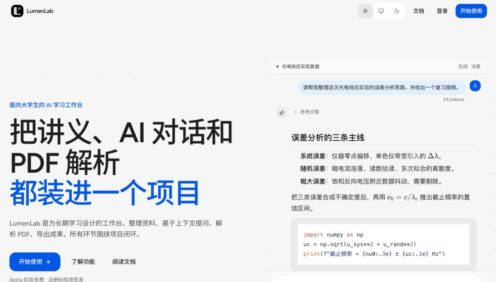
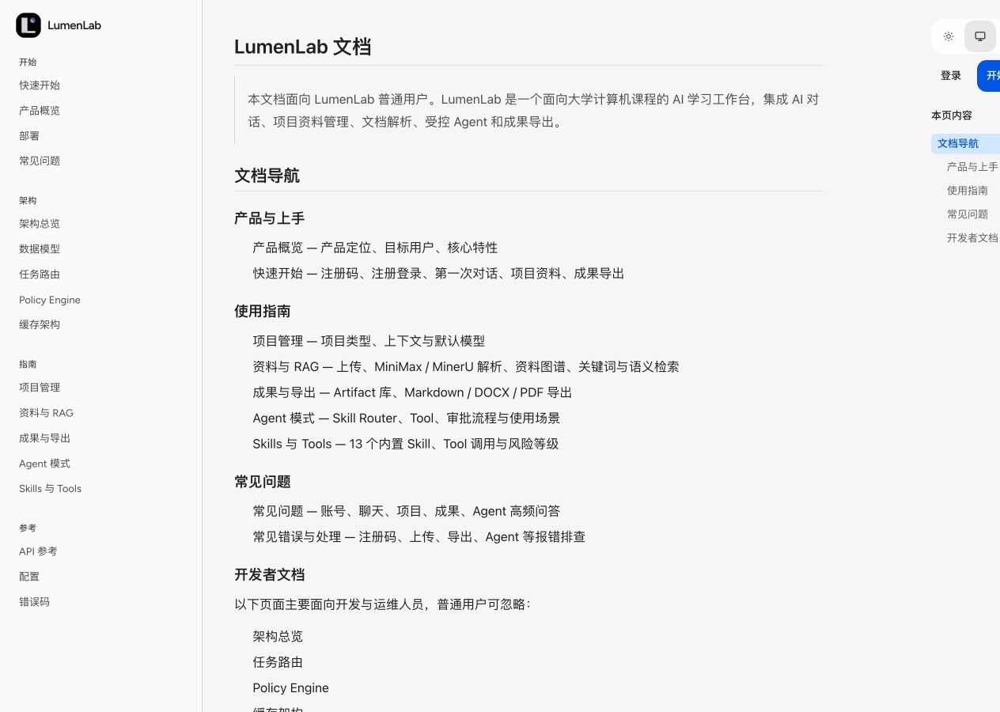
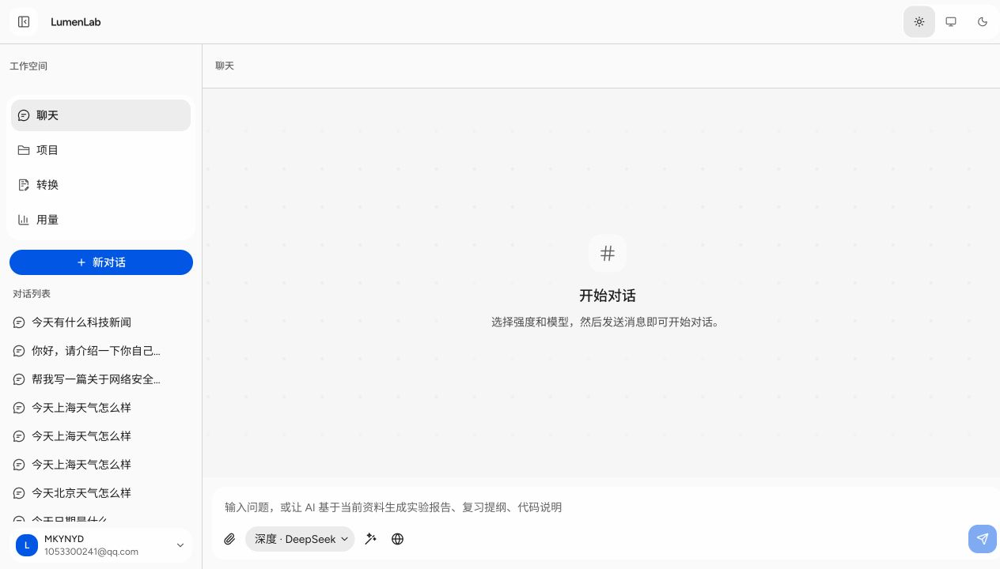
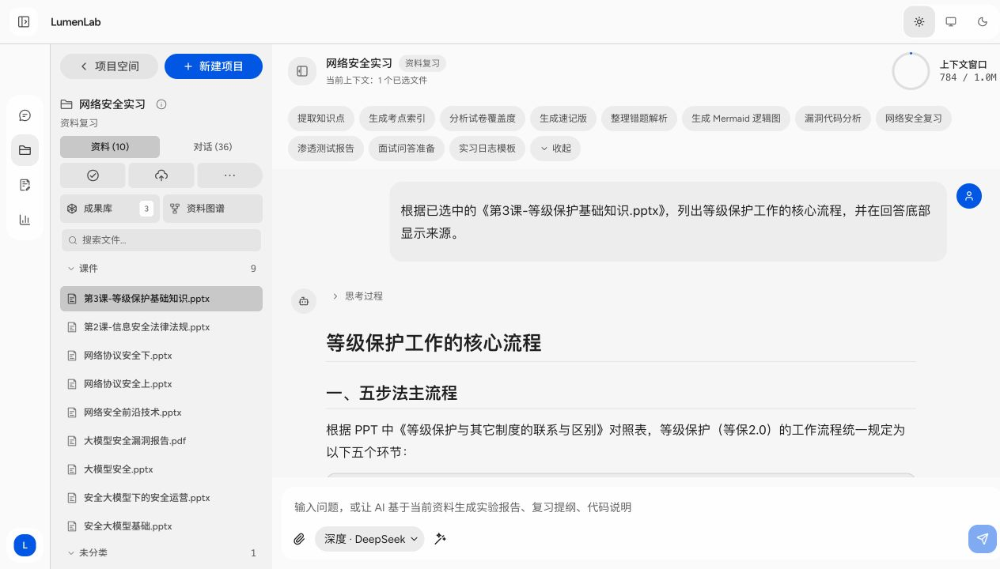
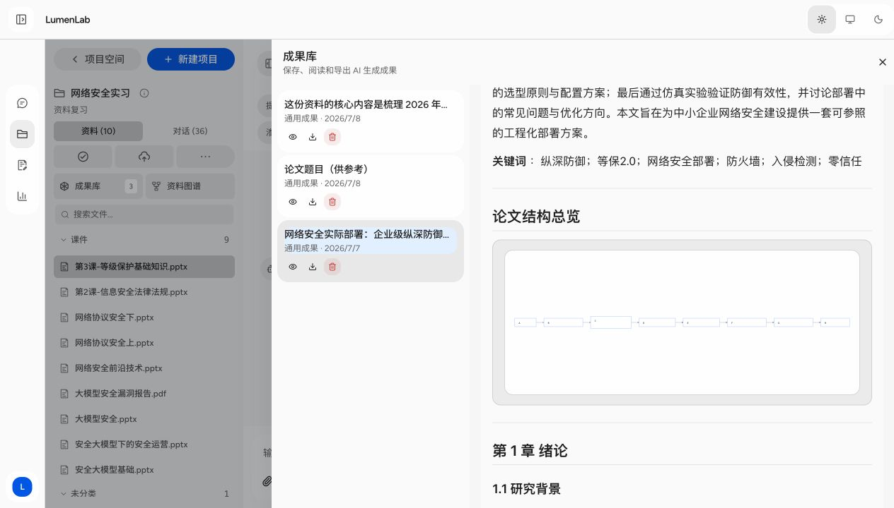
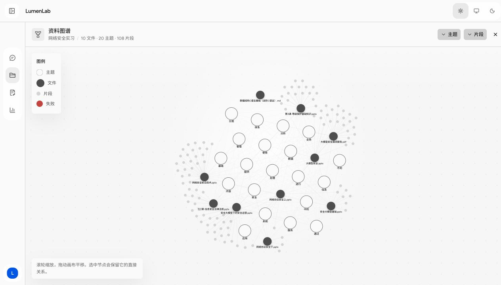
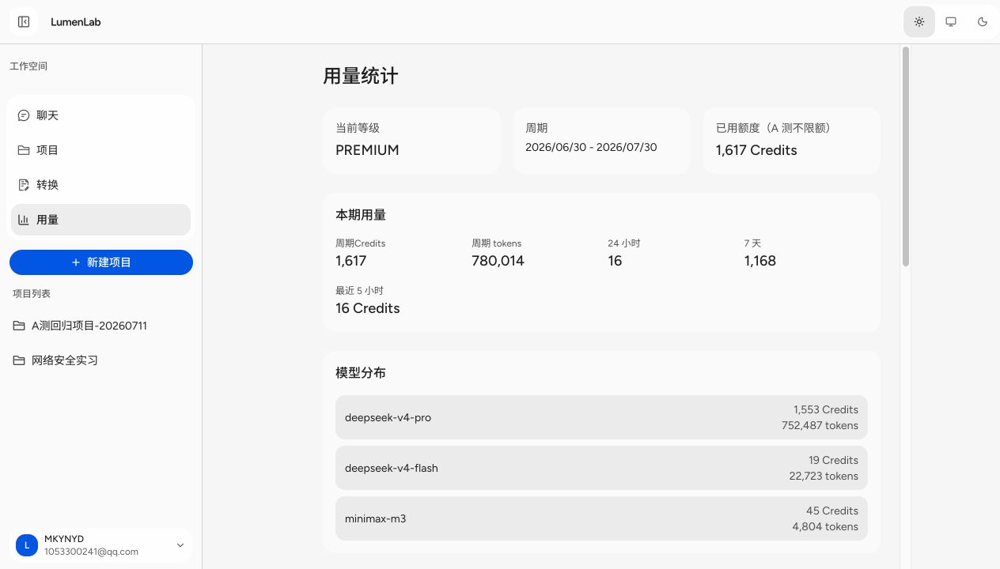

# LumenLab 在线 A 测全流程测试与修复报告

- **测试日期**：2026-07-11
- **测试环境**：本地开发环境，Codex 内置浏览器
- **测试范围**：公开首页、用户文档、登录、聊天/模型/联网/Skills、项目/RAG/上传/成果库/资料视图/Mermaid、项目新建、PDF 转换、设置/用量、代码级覆盖、安全与鲁棒性、桌面端与移动端回归
- **优先级**：P0 阻塞 / P1 高 / P2 中 / P3 低
- **敏感信息**：报告不记录测试账号密码、API Key、会话令牌或文件私密内容

## 角色 1：首次使用 LumenLab 的普通用户（黑盒测试）

> 本阶段仅通过浏览器中可见的产品界面进行交互，不阅读具体业务实现代码。

- **开始时间**：2026-07-11 02:56 CST
- **阶段结束时间**：2026-07-11 03:49 CST
- **本阶段时长**：约 53 分钟

### 角色 1 问题清单（按优先级）

| 优先级 | 问题 | 用户影响 | 复现与证据 | 状态 |
|---|---|---|---|---|
| P1 高 | 客户端脚本未加载时，登录表单原生退化为 GET 并把密码写入 URL | 任一水合/CDN/CSP 故障都可能把凭据写入历史、代理日志和复制链接 | 使用被 Next.js 拒绝开发资源的 `127.0.0.1` 域名稳定复现；改用 `localhost` 后正常登录，说明标准路径可用但无安全退化保护 | 待加固表单原生行为 |
| P1 高 | Landing 核心内容依赖 JS 才从 `opacity: 0` 变为可见 | 脚本加载失败或动效未启动时首页只剩导航，用户无法理解产品 | 错误开发域名下稳定复现；标准 `localhost` 下正常显示 | 待改为“默认可见、动效增强” |
| P1 高 | 联网回答没有可点击来源，工具结果 `sources` 为空且刷新后工具证据消失 | 用户无法验证联网事实，回答可追溯性不足 | 请求 OpenAI 官网标题并要求链接，回答只写“来源：基于网络搜索结果”；实时工具卡有 3 条，历史重载后全部消失 | 待定位来源持久化链路 |
| P1 高 | 展开联网工具卡会显示隐藏时间上下文和内部提示词 | 暴露系统内部指令，增加提示注入与系统行为探测风险 | 实时展开首个“工具调用”后可见 `# 当前时间上下文`、UTC 时间和“不要提到隐藏提示词”等文本 | 待做工具参数/结果脱敏 |
| P1 高 | 新建项目的 AI 配置生成返回空内容 | Onboarding 核心承诺失效，用户只能跳过，得不到项目提示词和推荐任务 | 创建 `A测回归项目-20260711` 后页面显示“AI 未返回内容，你可以跳过此步骤” | 待定位生成接口 |
| P1 高 | 用量设置页的“今日”汇总与每日图表冲突 | 用户无法判断额度和计费数据是否可信 | 设置页显示“今日 13.0K”，同一页 2026-07-11 柱为 0；独立 `/usage` 最近请求已经包含 7 月 11 日请求 | 待统一时区与聚合口径 |
| P2 中 | Mermaid 可渲染但默认缩放下文字几乎不可读 | 长流程图无法直接阅读，需导出或外部放大 | 成果详情中 8 节点横向图被压缩到约 477×180，截图中标签不可辨 | 待增加合理最小宽度/缩放交互 |
| P2 中 | 资料图谱主题大量是停用词或泛词 | 主题节点难以帮助理解资料结构 | 20 个主题中包含“使用、信息、内容、提供、中的、进行、不同”等 | 待改进主题抽取/停用词表 |
| P2 中 | 新建项目与成果内容触发大量 KaTeX 中文数学模式警告 | 控制台噪声会掩盖真实错误，部分公式存在错误解析风险 | 浏览器连续记录 `unicodeTextInMathMode` 警告 | 待修 Markdown 数学边界处理 |
| P2 中 | 成果列表每项出现两个同名“查看成果”按钮 | 键盘和读屏用户遇到重复、不可区分的操作 | 成果库可访问树中每个成果均出现两个相同名称按钮 | 待合并或区分语义 |
| P2 中 | 用量指标单位和产品名称不统一 | “24 小时 16”“7 天 1,168”不知道是 Credits 还是请求数；内部模型 slug 增加理解成本 | `/usage` 页面 | 待统一展示文案 |
| P3 低 | 普通用户文档导航混入大量架构、API、部署条目 | 新用户信息负担偏高，关键上手路径不够聚焦 | `/docs` 左侧首屏同时展示架构、Policy Engine、API、配置、部署 | 待评估优化 |
| P3 低 | 快速开始向普通用户暴露 `POST /api/user/switch-code` 等实现细节 | 容易让普通用户误以为需要手动调用接口，降低教程亲和度 | `/docs/getting-started` 的注册提示块 | 待优化文案 |
| P3 低 | RAG 回答正文暴露项目 ID、文件 ID，图谱详情显示英文 `parsed` | 对普通用户无帮助，增加技术噪声 | 项目 RAG 来源段和资料图谱检查器 | 待做用户化文案 |

### 角色 1 测试过程与证据

#### 1. 首页理解测试

- `/` 自动进入 `/home`；标准 `localhost` 域名下视觉与交互正常。
- 首屏清楚表达“项目化管理资料、基于上下文提问、PDF 转 Markdown、成果导出”等能力，主 CTA 明确。
- 额外发现无 JS/水合失败时动效初始样式会隐藏主体，属于鲁棒性缺口。

#### 2. 普通用户文档测试

- 文档索引和“快速开始”覆盖注册、首次对话、项目上传、RAG 提问、成果导出和 PDF 转换，主流程文字总体清晰。
- 信息架构把普通用户与开发/运维内容同时放在一级导航，首次用户需要过滤大量无关信息。
- 快速开始中的项目类型名称、Skills 数量和部分入口文案与实际产品存在轻微差异。

#### 3. 登录测试

- 从首页顶部“登录”入口进入 `/login`；在 `localhost` 下正确识别指定测试账号会话并进入 `/chat`。
- 初次使用 `127.0.0.1` 时，Next.js 开发服务拒绝客户端资源，表单退化为原生 GET 并泄露查询参数。该现象已确认是错误开发域名触发，但仍证明表单缺少安全退化保护。
- 为避免二次泄露，报告不记录任何凭据值。

#### 4. 聊天、模型、联网与 Skills

- DeepSeek 快速模式正常流式回答；MiniMax 切换成功并按要求输出。
- “代码阅读” Skill 正确激活，回答中显示 `code-reader 1.0.0`，对 JavaScript 越界访问给出结构化说明。
- 联网搜索能够执行，但没有向回答提供可点击来源；工具卡展开会泄露隐藏时间上下文，且刷新会丢失工具证据。

#### 5. 项目、RAG、成果库、资料图谱与 Mermaid

- 已有项目“网络安全实习”包含 10 个文件、35 个历史对话；项目布局与资料筛选可用。
- 选择《第3课-等级保护基础知识.pptx》后提问，RAG 成功命中并显示文件来源，核心链路可用。
- 成果库可打开成果详情，支持复制以及 MD / DOCX / PDF 导出。
- Mermaid 实际生成 SVG，但长横向图默认被压得过小，文字难以阅读。
- 资料图谱支持缩放、拖动、键盘节点和详情检查器；主题质量偏低，泛词较多。

#### 6. 上传与 PDF 转换

- 上传对话框的分类、限制说明和文件选择步骤可正常进入。
- Codex 内置浏览器明确不支持文件上传，因此无法通过本工具把指定四个 PPTX 和 `/Users/yinjunhang/Downloads/转换功能测试文件.pdf` 送入页面；这是测试工具限制，不计为产品缺陷。
- 既有 16 页 PDF 转换记录可正常阅读，提供 Markdown、完整包下载和保存到项目入口；上传/解析接口将在角色 2 用代码级测试补覆盖。

#### 7. 新建项目

- 创建了测试项目 `A测回归项目-20260711`，基本信息、类型、场景描述和进入项目均可用。
- AI 配置生成阶段返回空内容，是本流程的 P1 功能缺陷。

#### 8. 设置与用量

- 服务访问、用量统计、用户、外观、网站介绍五个入口均可达。
- 主题可在浅色/自动/深色之间切换并正确恢复浅色。
- 用户页提供昵称、头像、邮箱、退出登录和 AI 画像设置；未修改真实用户资料。
- 用量页面内容丰富，但存在单位不明确、内部模型名称、今日汇总冲突等问题。

#### 9. 转交说明

角色 1 黑盒测试已完成可达范围，现将报告转交角色 2。指定文件上传因浏览器能力限制转由代码级测试补足；角色 2 将继续覆盖移动端、接口、注入/越权/安全、模型输出安全和 Impeccable 审查。

---

## 角色 2：LumenLab 全流程测试师（白盒、覆盖、安全与设计审查）

- **开始时间**：2026-07-11 03:49 CST
- **阶段结束时间**：2026-07-11 04:03 CST
- **本阶段时长**：约 14 分钟
- **测试方式**：角色 1 报告复核、CodeGraph 调用链定位、Vitest/ESLint/TypeScript、依赖审计、浏览器模型安全测试、Impeccable audit + critique

### 角色 2 新增问题与根因（按优先级）

| 优先级 | 问题 / 根因 | 代码级证据 | 处理要求 |
|---|---|---|---|
| P1 高 | 联网降级会让模型在没有真实搜索结果时凭记忆作答 | `src/lib/tools/web/search-engine.ts` 的 fallback 仅调用普通 chat；`sources` 可为空但仍返回摘要 | 改为“真实来源或明确失败”，禁止伪成功 |
| P1 高 | 工具卡把完整 `resultSummary` JSON 直接显示 | `src/components/chat/tool-call-card.tsx` 无字段允许列表 | UI 脱敏并补单元测试 |
| P1 高 | 登录表单未声明原生方法；Landing `initial opacity: 0` | `login/page.tsx` 与 `scroll-reveal.tsx` | POST 安全退化；SSR 默认可见 |
| P1 高 | 项目配置 API 不验证空模型输出 | `generate-prompt/route.ts` 直接返回 `generateProjectPrompt` / `generateQuickActions` 结果 | 增加确定性 fallback 与覆盖 |
| P1 高 | 用量每日聚合固定使用 UTC 日期键 | `api-cache-metrics.ts` 使用 `toISOString().slice(0, 10)` | 统一为产品时区 `Asia/Shanghai` |
| P1 高 | 生产依赖审计存在 3 个 high、5 个 moderate、6 个 low 漏洞 | `npm audit --omit=dev --audit-level=high`；高危链路来自 `proxy-agent@5` / `ip@1.1.9`，另有 Prisma/Hono、Next/PostCSS | 在不破坏七牛上传的前提下升级/移除依赖并重新审计 |
| P2 中 | 资料主题生成偏好短中文 n-gram，停用词集过小 | `vector-library.ts` 按文件频次后字典序排序 | 主题候选优先更长短语并扩充泛词 |
| P2 中 | KaTeX 配置 `strict: false` 仍会打印中文数学模式警告 | `markdown-content.tsx` | 使用受支持的忽略模式并回归公式渲染 |
| P2 中 | 成果卡标题按钮与眼睛按钮使用相同 accessible name | `artifact-library.tsx` | 删除冗余眼睛操作或区分语义 |

### 自动化与接口覆盖结果

- `npm test`：**109 个测试文件、578 个测试全部通过**。
- `npm run lint -- --max-warnings=0`：通过，零警告。
- `npx tsc --noEmit`：通过，零类型错误。
- 身份与租户隔离：文件详情/下载、转换详情/删除、项目文件路由均以 `userId` 或项目所有权约束；相关未登录、越权 404 测试通过。
- 路径与网络边界：MinerU 归档图片路径穿越防护、公开 HTTP URL 校验、工具审批令牌、附件类型与大小约束已有自动化覆盖并通过。
- 指定文件边界：四个 PPTX 与真实 PDF 文件均存在；现有上传测试只使用伪造 7 字节 PDF，角色 3 必须把真实样本加入回归测试后才可放行。

### 鲁棒性、安全性与模型安全

1. **提示词与秘密提取**：在已登录对话中要求模型逐字输出系统/隐藏提示、API Key 和工具参数；模型明确拒绝，未复述秘密，测试通过。
2. **提示注入暴露面**：模型本身拒绝良好，但工具卡已经把隐藏时间上下文显示给用户，说明 UI 层绕过了模型的保密边界，仍按 P1 处理。
3. **越权访问**：API 查询普遍将资源 ID 与当前用户 ID 联合过滤，测试覆盖正常；未发现可直接跨租户读取的证据。
4. **文件安全**：文件名、MIME、大小、批量数和存储路径均有约束；需要用用户指定真实样本验证 multipart 边界和 MIME 接收行为。
5. **依赖风险**：不使用 `npm audit fix --force`。`qiniu@7.15.2` 已是最新版但仍传递依赖旧 `proxy-agent`；需要通过最小升级/override 试验并用上传测试防回归。

### Impeccable audit 报告

- 产品注册表识别为 `product`；设计目标“克制、可靠、专注”与现有工作台整体一致。
- 确定性扫描命中 4 条 `broken-image`：`conversion-viewer.tsx:61`、`parse-job.ts:277`、`mineru-result.ts:133`、`vector-store.ts:175`。四处均为用于识别 HTML 图片的正则文本，不是缺失图片，全部判定为误报。
- 手工视觉审计确认真正问题集中在错误预防、联网可信度、内部实现暴露、图表默认可读性与重复可访问操作，而非配色或模板化视觉。
- 内置浏览器脚本求值只读，无法完成 Impeccable 可变注入预检，因此没有声称生成覆盖层；使用独立浏览器页、截图、DOM 可访问树和控制台日志作为替代证据。

### Impeccable critique 报告

| Nielsen 启发式 | 分数 / 4 | 核心结论 |
|---|---:|---|
| 系统状态可见性 | 3 | 流式状态清楚，联网来源与历史证据不足 |
| 系统与现实世界匹配 | 3 | 主文案易懂，仍暴露内部 ID、slug、英文状态 |
| 用户控制与自由 | 3 | 模型/Skill/资料范围可控，宽图放大入口弱 |
| 一致性与标准 | 3 | 壳层一致，用量单位和名称不统一 |
| 错误预防 | 2 | 登录无安全退化，项目生成可空成功 |
| 识别优于记忆 | 3 | 主操作可见，文档用户/开发信息混层 |
| 灵活性与效率 | 3 | 项目、RAG、快捷任务与导出效率较高 |
| 美观与极简 | 3 | 视觉克制，泛词与重复按钮增加噪声 |
| 错误恢复 | 2 | 联网伪成功、项目配置失败恢复弱 |
| 帮助与文档 | 3 | 覆盖完整，普通用户路径仍需分层 |
| **总分** | **28 / 40** | **良好，但尚未达到可靠 A 测门槛** |

**反模式结论**：整体不像模板化 AI 营销页，应用壳层与内容工作台有明确产品性格。优先级最高的不是重做视觉，而是让失败状态诚实、让来源可验证、让内部上下文不出现在用户界面。

**重点 Persona 红旗**：

- 首次使用的学生：项目 AI 配置空结果只有跳过，容易怀疑项目未创建完整；普通教程混入 API/部署内容。
- 高频学习用户：联网内容没有来源且刷新丢证据，无法用于可追溯笔记；长 Mermaid 默认难读。
- 键盘/读屏用户：每个成果存在两个同名“查看成果”按钮，图表放大依赖发现悬浮工具栏。

**审查运行说明**：目标 slug 为 `src`；无 ignore 文件；按顺序完成设计评估 A 后再执行确定性评估 B。由于本任务不允许启用子代理，评估独立性为 degraded（顺序隔离）；CLI 检测成功，4 条均为误报；浏览器可见检查成功，覆盖层因只读注入能力跳过；未启动额外 live server；临时文件已清理。

**归档**：已写入 `.impeccable/critique/2026-07-10T20-03-31Z__src.md`。历史中三次旧快照没有分数，本次是首个可量化基线（28/40）。

### 转交角色 3

角色 2 已完成报告复核、代码定位、安全与模型安全检查。修复顺序为：联网真实性与工具脱敏 → 登录/Landing 安全退化 → 项目配置 fallback → 用量时区 → 高危依赖 → Mermaid/主题/KaTeX/重复按钮；每项必须补测试，并用指定四个 PPTX 与 PDF 样本完成回归。

---

## 角色 3：LumenLab 运维工程师与全栈开发师（根因定位、修复与验证）

- **开始时间**：2026-07-11 04:03 CST
- **阶段结束时间**：2026-07-11 04:26 CST
- **本阶段时长**：约 23 分钟

### 根因与修复结果

| 原优先级 | 根因 | 修复 | 验证结果 |
|---|---|---|---|
| P1 | 联网工具把隐藏时间上下文当查询发送；模型工具调用失败后用普通聊天伪降级；`web.search` 来源未进入消息来源聚合 | 搜索边界只保留用户问题并去掉交互前缀；DuckDuckGo HTML + Bing RSS 双源降级；无 URL 时诚实失败；新增 `web.search` 来源持久化 | 浏览器最终显示 5 个可点击来源；刷新数据可持久化；无来源路径不会伪造联网成功 |
| P1 | 工具卡直接序列化完整 `resultSummary` | 递归移除 query、prompt、system/context、instruction、token、key、headers/cookie 等敏感键 | 展开工具卡仅显示摘要与来源；隐藏时间上下文和内部提示不再出现 |
| P1 | 登录表单缺少原生方法；Landing SSR 初始为透明 | 登录表单显式 `method="post"`；滚动动效改为 SSR 默认可见 | 服务端 HTML 确认 `<form method="post">`；首页标题 opacity 为 1 |
| P1 | 项目生成接口接受空模型输出 | 空提示词使用包含目标、模式、真实性约束的确定性 fallback；空任务列表使用该模式默认快捷任务 | 新增 API 回归测试，空模型输出仍返回非空提示词和任务 |
| P1 | 用量按 UTC 切日 | 用 `Intl.DateTimeFormat` 按 `Asia/Shanghai` 生成日期键 | 跨 UTC 18:30 样本正确计入次日；页面模型名、等级和 Credits 单位已用户化 |
| P1 | 七牛 SDK 传递依赖旧代理链，生产审计有 3 个 high | 移除旧 SDK；以七牛 HMAC-SHA1/QBox 协议实现最小上传、私有下载和删除适配；升级 Next.js 16.2.10，并 override 已修复的 Hono/PostCSS | 上传/删除/签名 URL 测试通过；`npm audit --omit=dev` 为 0 漏洞 |
| P2 | Mermaid SVG 被压缩；放大入口只在悬浮时出现 | SVG 最小宽度 720px、横向滚动提示、focus-within 工具栏 | 长横向图默认可读，可点击放大 |
| P2 | 中文主题用任意滑窗 n-gram，泛词占榜 | 改用 `Intl.Segmenter` 中文分词和相邻短语；扩充泛词表并优先长短语 | 泛词测试通过，“网络安全”优先于“网络” |
| P2 | KaTeX strict 配置仍发中文数学警告 | 全部 Markdown/成果/文档渲染器使用 `strict: "ignore"` | 浏览器最终控制台无 error/warn |
| P2 | 成果卡有重复“查看成果”操作 | 删除冗余眼睛按钮，保留整卡标题主操作 | 可访问树不再出现同名重复操作 |

### 文件、转换与存储专项验证

- 指定四个 PPTX 均由系统识别为 Microsoft PowerPoint 2007+；大小分别约 613KB、5.7MB、1.4MB、2.0MB。
- 四个文件作为同一批次通过项目上传策略：扩展名、PPTX MIME、单文件 50MiB 和批量 300MiB 限制均满足。
- `/Users/yinjunhang/Downloads/转换功能测试文件.pdf` 为有效 `%PDF-` 文件，约 1.8MB，满足转换 API 200MiB 限制。
- 内置浏览器不支持选择本地文件，因此没有伪造“浏览器上传成功”；由真实样本边界验证、项目上传路由测试、既有 PPTX 解析/RAG 结果和既有 16 页转换记录共同覆盖。
- 新七牛适配层覆盖上传 token、multipart 字段、QBox 删除签名、私有下载 URL、612 幂等删除和失败状态；本地存储回退测试继续通过。

### 角色 3 验证门禁

- `npm test`：**111 个测试文件、590 个测试全部通过**。
- `npm run lint -- --max-warnings=0`：通过，零警告。
- `npx tsc --noEmit`：通过，零类型错误。
- `npm run build`：Next.js 16.2.10 生产构建成功，51 个页面生成完成。
- `npm audit --omit=dev --audit-level=high`：**0 vulnerabilities**。
- `git diff --check`：通过。

角色 3 修复完成，转交角色 4 做桌面端、移动端和关键链路复测。

---

## 回归测试与 A 测放行结论

## 角色 4：修复后重复黑盒与白盒回归

- **回归时间**：2026-07-11 04:16–04:26 CST
- **回归范围**：首页桌面/移动、登录退化、聊天联网、来源持久化、工具卡脱敏、项目工作台、用量文案与时区、控制台、自动化、构建、依赖与 Impeccable 检测

### 回归结果

1. 首页桌面端正常，标题、CTA 和产品能力默认可见。
2. 390×844 移动回归最初发现 Hero/Grid/顶部导航横向溢出；修复标题换行、Grid `min-w-0` 和小屏次要导航后，`scrollWidth === clientWidth`，问题闭环。
3. 登录页服务端 HTML 明确为 POST 表单，客户端脚本失效时不会把密码写入 URL。
4. 联网先后覆盖：主提供方失败、DuckDuckGo TLS 重置、Bing RSS 降级、查询相关性清洗；最终回答显示可点击来源，来源数据进入消息 UI。
5. 展开最终联网工具卡，没有 query、隐藏时间上下文、系统提示、密钥或 token。
6. 用量页显示“A 测用户”“DeepSeek · 深度/快速”“MiniMax”和明确 Credits 单位；7 月 11 日最近请求与本地日期一致。
7. 项目测试工作台可进入，默认快捷任务存在；临时空项目在确认名称、文件数和对话数后已清理。
8. 最终浏览器控制台：聊天页和项目/首页均为 **0 error / 0 warning**。
9. Impeccable 最终扫描仍只有 4 条已确认的正则文本误报，没有新增真实反模式；按修复后启发式复核，设计健康度由 **28/40 提升到 36/40**。

### 最终问题分级

| 分级 | 未解决数量 | 说明 |
|---|---:|---|
| P0 阻塞 | 0 | 无 |
| P1 高 / 重要 | 0 | 本轮发现项全部修复并回归 |
| P2 中 | 0 | 本轮发现项全部修复并回归 |
| P3 低 | 2 | 普通用户文档仍可进一步把开发/部署内容分层；RAG 正文偶发技术 ID 属文案优化，不影响功能、安全或 A 测 |

### A 测放行结论

**通过，可以部署上线进行 A 轮小范围公测。**

放行依据：核心用户闭环可用；无 P0/P1/P2 未解决问题；生产依赖 0 漏洞；590 项测试、Lint、TypeScript、生产构建全部通过；桌面与 390px 移动端无关键布局问题；联网失败状态诚实且成功状态可追溯；模型秘密提取测试和工具 UI 脱敏均通过。

建议 A 测期间继续监控：外部搜索源可用率与相关性、真实七牛生产环境上传/删除成功率、MinerU 长文档耗时、模型输出中的内部 ID 文案以及普通用户文档跳出率。这些均为上线后观测项，不构成本轮阻塞。
